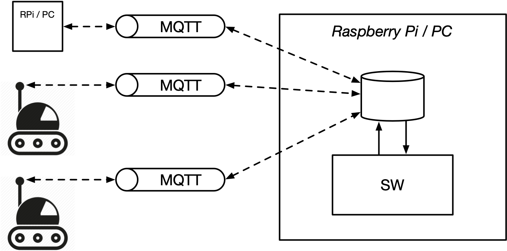

# roboRinth – Collaborative Robot Challenge

## Project description

The goal is to examine a labyrinth of lines with multiple (2-3) robots, find an optimal path from start to finish and possibly collect tokens within the labyrinth

### Setup
- 2-3 Lego Mindstorm robots
    - They come with [preinstalled MQTT client application](ev3/readme.md)
    - Actors (motors)
    - Sensors (brightness sensor, gyroscope, …)
    - ev3dev OS to run any code on the robot
    - MQTT client
    - WiFi dongle to communicate with server
- Raspberry Pi / PC as server
    - preconfigured as MQTT broker. [Details here](mosquitto/readme.md)
- Raspberry Pi's / PC's as MQTT clients

The network infrastructure is preconfigured. [Have a look at the details](infrastructure/readme.md)

### Idea of the challenge
- <https://www.youtube.com/watch?v=6K-78wloOzY>

### Proposition for team splitting
- 1 team logic on robots (sensors, actors, communication)
- 2 teams logic on server (data analysis, map composition, tasks & instructions)

### Time for project
- Start: Monday, 21st of October, after arrival
- End: Wednesday, 23rd of October, before lunch

### Programming language
- possibly Python

### Requirements to PC
- possibly Docker
- possibly VirtualBox
